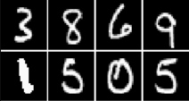
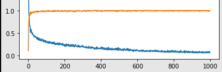

# HandWrittenDigit Classification

This repository presents the basic notions of training a CNN on a handwritten digit dataset.

## Definition

Handwritten digit recognition is the ability of a computer to recognize the human handwritten digits from different sources like images, papers, touch screens, etc, and classify them into 10 predefined classes (0-9) this repository tries to classify MNIST dataset into its respective classes using the CNN architecture which was first introduced by Yann Lecun and it still widely used.

convolutional neural network (CNN, or ConvNet) is a class of artificial neural network (ANN), most commonly applied to analyze visual imagery. CNN's are also known as Shift Invariant or Space Invariant Artificial Neural Networks (SIANN), based on the shared-weight architecture of the convolution kernels or filters that slide along input features and provide translation-equivariant responses known as feature maps.

## Configure the environment
- Install all the dependencies required to run the model
```shell
(base)$: pip3 install .
```
- Move to the folder 
```shell
(base)$: cd classification
```
- Run (default)
```shell
(base)$: python3 eval.py
```
- Run (custom image)
```shell
either change the data through the variable or enter it manually for now 
```

## Navigation 
- eval.py : stores the code for evaluating the model
- utils.py : stores the code for training the architecture on MNIST 
- model.py : initializes the architecture 
- pretrained : has the trained model 

## Models

Definition and training of some models with MNIST. One used to train this model is named ModelM3 which uses a bunch of filter banks with batch normalization on alternate layers trained on Adam optimizer.

### MNIST dataset

The MNIST database of handwritten digits, available from this page, has a training set of 60,000 examples, and a test set of 10,000 examples. It is a subset of a larger set available from NIST. The digits have been size-normalized and centred in a fixed-size image.

## Results
Training models with Pytorch.

| Epoch 00                          | Epoch 100                          | Loss                                |
| --------------------------------- | ---------------------------------- | ----------------------------------- |
|  |  |  |
| [1, 1, 1, 1, 1, 1, 1, 1] | [3, 8, 6, 9, 1, 5, 0, 5] | Loss : 0.07  Accuracy : .99 |


## References
    * [THE MNIST DATABASE of handwritten digits](http://yann.lecun.com/exdb/mnist/)
